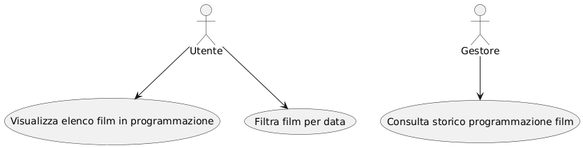
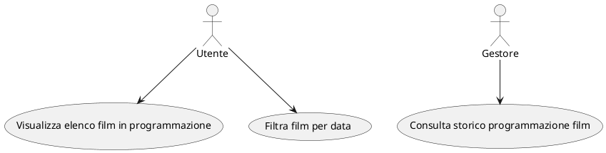

# 📑 Analisi del progetto Cinemille

Il progetto **Cinemille** è un’applicazione per la gestione e la consultazione della programmazione cinematografica.
Gli obiettivi principali sono:

* Consentire agli utenti di visualizzare l’elenco dei film in programmazione.
* Permettere ai gestori della piattaforma di consultare lo storico delle programmazioni passate.
* Fornire un’infrastruttura moderna basata su **Spring Boot** (backend REST) e **Angular** (frontend).

---

## Requisiti funzionali

* **RF1 – Elenco film in programmazione**
  L’applicativo deve consentire di visualizzare una lista dei film in programmazione, con possibilità di filtrare per data di inizio/data fine.

* **RF2 – Storico programmazione**
  Deve essere possibile per i gestori accedere allo storico completo della programmazione dei film passati.

---

## Requisiti tecnici / non funzionali

* **RT1 – Schema logico**: Modellazione UML del dominio (entità Movie, Schedule).
* **RT2 – Backend REST API**: realizzazione Web Service con Spring Boot.
* **RT3 – Frontend**: realizzazione dell'interfaccia utente con Angular.

---

## Attori

* **Utente**
  Consulta i film in programmazione e li filtra per data.

* **Gestore**
  Accede allo storico completo della programmazione dei film.

---

## Use Case Diagram (semplificato)

---

## Descrizione dei casi d’uso nel dettaglio

### UC1 – Visualizza elenco film in programmazione filtrando per data

* **Attore**: Utente
* **Pre-condizioni**: L’applicativo è avviato, il backend è in ascolto.
* **Flusso principale**:

    1. L’utente accede alla sezione "Schedules".
    2. Seleziona la settimana di cui è interessato a consultare la programmazione.
    3. Seleziona il giorno.
    4. Il sistema mostra la lista dei film disponibili.
* **Post-condizioni**: L’utente visualizza l’elenco aggiornato dei film filtrato per la data selezionata.

---

### UC2 – Consulta storico programmazione film

* **Attore**: Gestore
* **Pre-condizioni**: L’applicativo è avviato, il backend è in ascolto.
* **Flusso principale**:

    1. Il gestore accede alla sezione "History".
    2. Il sistema restituisce la lista completa delle programmazioni passate.
* **Post-condizioni**: Il gestore visualizza lo storico.