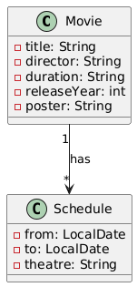
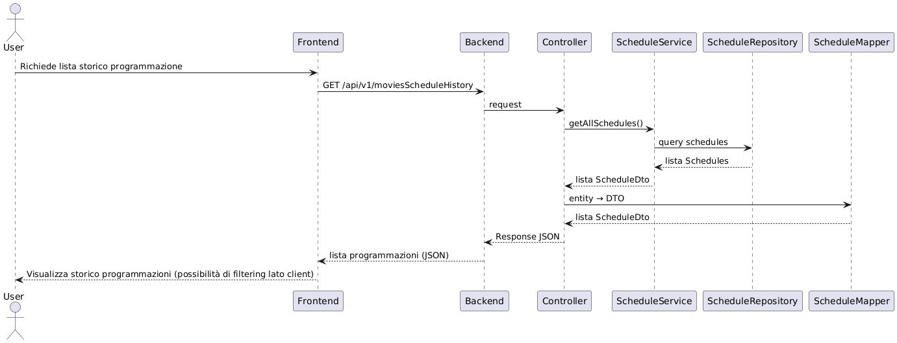
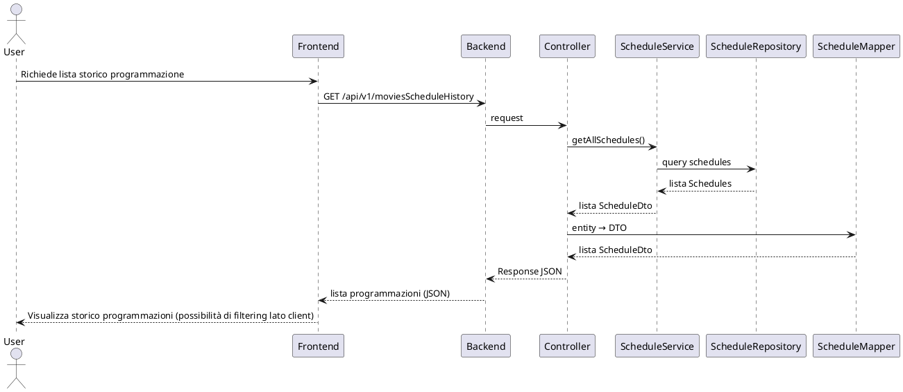

# 🏗️ Architettura del progetto Cinemille

Questo documento descrive l’architettura logica del sistema, includendo un **Class Diagram** (struttura dati) e un **Sequence Diagram** (flusso delle chiamate principali).

---

## 📂 Panoramica architetturale

L’applicazione segue un’architettura **client-server**:

- **Frontend**: Angular  
  - Interfaccia utente per visualizzare i film in programmazione e lo storico.
  - Consuma le REST API esposte dal backend.

- **Backend**: Spring Boot  
  - Espone API REST su `/api/v1/...`.
  - Contiene logica di business, mapping DTO e accesso ai dati.
  - Strutturato secondo pattern **Controller → Service → Repository**.

- **Database**:  
  - Gestisce le entità principali `Movie` e `Schedule`.  
  - Relazione 1 → * (un film può avere più programmazioni).

---

## 📊 Class Diagram

Il diagramma mostra le principali entità e le relazioni:

```plantuml
@startuml

class Movie {
  - title: String
  - director: String
  - duration: String
  - releaseYear: int
  - poster: String
}

class Schedule {
  - from: LocalDate
  - to: LocalDate
  - theatre: String
}

Movie "1" --> "*" Schedule : has

@enduml
````

---

## 🔄 Sequence Diagram

Il seguente diagramma rappresenta il flusso tipico di una richiesta **"Lista film in programmazione per data"**:

![sequence_diagram_getFilmByDate.png](uml/sequence_diagram_getFilmByDate.png)

```plantuml
@startuml

actor User
User -> Frontend: Richiede lista film (selezione data)
Frontend -> Backend: GET /api/v1/moviesSchedule?date=YYYY-MM-DD
Backend -> Controller: request
Controller -> MovieService: getMoviesScheduleByDate(date)
MovieService -> MovieRepository: query film per data
MovieRepository --> MovieService: lista Movie
MovieService --> Controller: lista MovieDto
Controller -> MovieMapper: entity → DTO
MovieMapper --> Controller: lista MovieDto
Controller --> Backend: Response JSON
Backend --> Frontend: lista film (JSON)
Frontend --> User: Visualizza film filtrati

@enduml
```

Il seguente diagramma rappresenta il flusso tipico di una richiesta **"Lista storico programmazione"**:

---

## 🧩 Componenti principali

* **Controller**
  Gestisce le API REST, riceve le richieste HTTP e ritorna DTO al frontend.

* **Service**
  Contiene la logica di business.

* **Mapper**
  Converte le entità in DTO per separare modello dati e rappresentazione esterna.

* **Repository**
  Interagisce col database tramite JPA/Hibernate.

---

## 📌 Note

* L’architettura è modulare e segue i principi di **separation of concerns**.
* La comunicazione frontend-backend avviene tramite **JSON REST API**.
* La persistenza dei dati è demandata al DB relazionale.

---
